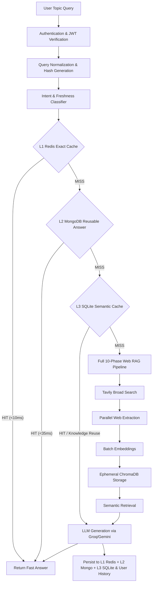

# Web-Grounded LLM Content Generation for Engineering Education

This is a complete, modular, production-grade Retrieval-Augmented Generation (RAG) pipeline designed to produce source-backed engineering educational content. The system uses Tavily Search API, Docling/Trafilatura layout scrapers, ChromaDB, Sentence Transformers, and Gemini 2.5 Flash.

To ensure safety and reliability, the system is designed to be completely **stateless**. No databases, documents, or vectors persist across pipeline runs. When a user queries a topic, the pipeline builds everything from scratch and completely tears down all temporary memory at the end of the run.

---

## Multi-Level Request Routing & Database Responsibilities



### Database Responsibility Matrix

| Database / Store | Tier | Primary Responsibilities |
| :--- | :--- | :--- |
| **Redis** | **L1 Hot Cache** | Fast microsecond exact answer lookup (`rag:exact:<hash>`), query embeddings (`rag:qembed:<hash>`), and semantic metadata index. |
| **MongoDB** | **L2 Application DB** | Secure user registration (`bcrypt` hashed passwords), persistent user-scoped query history, and reusable global answer metadata (`reusable_answers`). |
| **SQLite** | **L3 Semantic Cache** | Relational vector cache storing scraped web pages, text chunks, and embedding vectors (binary float32 BLOBs) for `KNOWLEDGE_REUSE`. |
| **ChromaDB** | **In-Memory Store** | Ephemeral per-query retrieval index created and garbage-collected per RAG execution. |

---

## Folder Structure

```text
RAG_using_Antigravity/
├── config/
│   ├── config.py                 # Central settings & database URIs (.env)
│   └── trusted_sources.py        # Whitelist of trusted educational domains
├── utils/
│   ├── auth.py                   # Bcrypt password hashing & JWT token verification
│   ├── logger.py                 # Structured file and console logger
│   └── helper.py                 # Timing and stdout formatting utilities
├── cache/
│   ├── cache_manager.py          # Single coordinator for L1/L2/L3 cache routing
│   ├── redis_store.py            # L1 In-Memory Redis Store
│   ├── mongo_store.py            # L2 Persistent MongoDB User & History Store
│   ├── sqlite_store.py           # L3 SQLite Persistent Page/Chunk/Vector Store
│   ├── semantic_cache.py         # Cosine decision engine (ANSWER_HIT / KNOWLEDGE_REUSE / MISS)
│   ├── query_normalizer.py       # Query normalization and SHA-256 hashing
│   └── intent_classifier.py      # Intent, scope, requirement, and freshness classifier
├── phase1..10/                   # Web-Grounded RAG Pipeline Phases 1-10
├── app.py                        # Flask Web Application & REST API
├── .env                          # Local API keys & DB configuration
├── .env.example                  # Template configuration file
├── requirements.txt              # Project package dependencies
└── README.md                     # Documentation
```


---

## Installation & Setup

1. **Clone the repository** and navigate to the project directory.

2. **Install Python dependencies**:
   Ensure you are using Python 3.12+ and execute:
   ```bash
   pip install -r requirements.txt
   ```

3. **Configure API Keys**:
   Copy the template environment variables file to `.env`:
   ```bash
   copy .env.example .env
   ```
   Open the `.env` file and populate it with your active API credentials:
   - `TAVILY_API_KEY`: Search API key from [Tavily AI Console](https://tavily.com).
   - `GEMINI_API_KEY`: Generative model key from [Google AI Studio](https://aistudio.google.com).

---

## Usage Guide

The system runs as an interactive Command Line Interface (CLI).

### 1. Interactive CLI Mode
Run the command below without arguments to start the interactive prompt loop:
```bash
python -m phase10.web_grounded_rag
```
You will be prompted to enter topics:
```text
============================================================
 WEB-GROUNDED LLM ENGINEERING RAG ASSISTANT CLI 
============================================================

Enter an engineering educational topic (or type 'exit' / 'quit' to close):
> Explain Deadlocks
```

### 2. Single-Shot CLI Mode
Provide the query topic directly as command line arguments to run a single execution:
```bash
python -m phase10.web_grounded_rag "Explain the Banker's Algorithm"
```

---

## Core Specifications & Best Practices

1. **Domain Constraint**: Search is strictly restricted to whitelisted educational, research, and documentation spaces like Wikipedia, Stanford, MIT OCW, Microsoft Learn, Python Docs, etc. (defined in `config/trusted_sources.py`).
2. **Scraper Resiliency**: Primary layout extraction uses Docling to preserve table structures. If any failure happens, it automatically switches to Trafilatura.
3. **No Database Footprint**: We spin up an ephemeral ChromaDB instance that stores data strictly in-memory. The collection is explicitly deleted, nullified, and garbage-collected at the end of each generation cycle, returning the system to an empty state.
4. **Deterministic Generation**: Gemini 2.5 Flash temperature is constrained to `0.2` to ensure precise, facts-only content generation from context and inline reference mapping.
