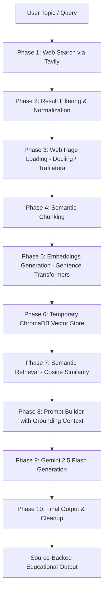

# Implementation Plan - Web-Grounded LLM Content Generation for Engineering Education

This document details the production-ready implementation plan for building a modular, stateless, web-grounded Retrieval-Augmented Generation (RAG) system using Tavily, Docling/Trafilatura, ChromaDB, Sentence Transformers, and Gemini 2.5 Flash.

---

## Architecture Overview



The system is designed to be completely **stateless**. A temporary vector database collection will be created at the beginning of a run and deleted immediately upon generation, ensuring that no data persists across sessions.

---

## Project Structure

We will adhere to the following project structure:

```text
RAG_using_Antigravity/
├── .env.example
├── .env
├── requirements.txt
├── README.md
├── config/
│   ├── __init__.py
│   ├── config.py
│   └── trusted_sources.py
├── utils/
│   ├── __init__.py
│   ├── logger.py
│   └── helper.py
├── phase1/
│   ├── __init__.py
│   └── web_search.py
├── phase2/
│   ├── __init__.py
│   └── result_filter.py
├── phase3/
│   ├── __init__.py
│   └── website_loader.py
├── phase4/
│   ├── __init__.py
│   └── chunker.py
├── phase5/
│   ├── __init__.py
│   └── embedder.py
├── phase6/
│   ├── __init__.py
│   └── vector_store.py
├── phase7/
│   ├── __init__.py
│   └── retriever.py
├── phase8/
│   ├── __init__.py
│   └── prompt_builder.py
├── phase9/
│   ├── __init__.py
│   └── gemini_client.py
└── phase10/
    ├── __init__.py
    └── web_grounded_rag.py
```

---

## User Review Required

> [!IMPORTANT]
> The system requires two API keys to function:
> 1. `TAVILY_API_KEY` for searching the web.
> 2. `GEMINI_API_KEY` for invoking Gemini 2.5 Flash.
>
> We will configure these in a local `.env` file. A sample `.env.example` will be provided.

---

## Proposed Changes

Here is the implementation roadmap split into structural setup and individual phases. As requested, we will write and test code **one phase at a time** starting with the structural setup and Phase 1, waiting for your approval before proceeding to the next.

### Base Infrastructure Setup

#### [NEW] [requirements.txt](file:///e:/StartUp/RAG_using_Antigravity/requirements.txt)
Define the dependencies for the project:
* `python-dotenv`: Environment variable loading.
* `tavily-python`: Web search.
* `requests`: For fallback HTTP requests.
* `docling`: High-quality document and webpage parsing to Markdown.
* `trafilatura`: Resilient fallback webpage text extractor.
* `langchain-text-splitters`: Semantically chunking extracted markdown.
* `sentence-transformers`: Local text embedding generation.
* `torch`: PyTorch engine for Sentence Transformers.
* `chromadb`: Lightweight vector store.
* `google-genai`: The official Gemini API client.

#### [NEW] [.env.example](file:///e:/StartUp/RAG_using_Antigravity/.env.example)
Example environment variables template.

#### [NEW] [logger.py](file:///e:/StartUp/RAG_using_Antigravity/utils/logger.py)
A centralized logging utility that provides unified formats, console coloring, and logs folder output.

#### [NEW] [helper.py](file:///e:/StartUp/RAG_using_Antigravity/utils/helper.py)
Utility functions to handle phase prints: `Loading...`, `Processing...`, `Success...`, `Failure...`, and timing metrics.

#### [NEW] [config.py](file:///e:/StartUp/RAG_using_Antigravity/config/config.py)
Configuration registry loading variables from `.env` and defining system defaults.

#### [NEW] [trusted_sources.py](file:///e:/StartUp/RAG_using_Antigravity/config/trusted_sources.py)
List of whitelisted trusted engineering and educational domains.

---

### Phase 1: Web Search Module

#### [NEW] [web_search.py](file:///e:/StartUp/RAG_using_Antigravity/phase1/web_search.py)
* **Goal**: Conduct targeted search using the Tavily Search API constrained to the trusted domains list.
* **Input**: User topic / query.
* **Output**: A structured list of results containing URL, title, snippet, and search score.
* **Interface & Testing**: Includes independent CLI execution `if __name__ == "__main__"` to test search functionality and query constraints.

---

### Subsequent Phases Roadmap

We will detail the files for the remaining phases once Phase 1 is approved and completed:
* **Phase 2**: URL filtering, normalization (`urllib.parse`), and whitelist validation.
* **Phase 3**: Webpage content acquisition (using Docling with a Trafilatura fallback).
* **Phase 4**: Semantic text chunking using `RecursiveCharacterTextSplitter`.
* **Phase 5**: Generating embeddings using `all-MiniLM-L6-v2`.
* **Phase 6**: Initializing, loading, and auto-deleting temporary ChromaDB collections.
* **Phase 7**: Performing semantic retrieval on ChromaDB chunks with Cosine Similarity.
* **Phase 8**: Building structured prompt injection templates with safety guidelines.
* **Phase 9**: Constructing the Gemini 2.5 Flash query client with targeted parameters.
* **Phase 10**: Integrating all components into a seamless, stateless executable pipeline (`web_grounded_rag.py`) with full timing, success/failure logs, and console outputs.

---

## Verification Plan

### Automated Verification
* Run unit verification for Phase 1 by executing `python -m phase1.web_search` with standard query inputs and examining printed outputs.
* Validate that Tavily results restrict themselves strictly to the whitelist domains.

### Manual Verification
* Inspect debug log files to verify start/end timestamps and warning/error levels.
